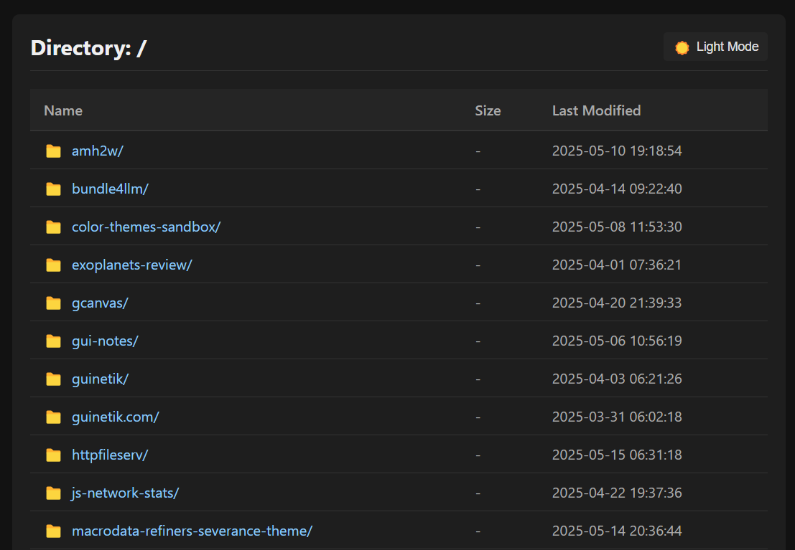

# httpfileserv



A lightweight C library for serving files over HTTP. Zero dependencies, minimal footprint.

## Demo


## Features

- Serve files and directory listings over HTTP
- Sleek and minimalistic design
- Cross-platform support (Linux, macOS, Windows) with clean separation of platform-specific code
- Directory listing with file sizes and modification dates
- Proper MIME type detection for common file types
- URL decoding for proper handling of special characters in URLs
- Basic security features (path traversal prevention)
- Extensive debugging and error handling
- Simple API for integration into other applications
- Custom MIME type configuration
- Request callbacks for logging and monitoring
- Socket timeout management to prevent stalled connections
- TCP_NODELAY support for improved responsiveness
- Keep-alive connections

## Project Structure

```
httpfileserv/
├── bin/                  # Compiled binaries
├── include/              # Header files
│   ├── httpfileserv.h    # Main header
│   ├── httpfileserv_lib.h # Library API
│   ├── http_response.h   # HTTP response handling
│   ├── platform.h        # Platform abstraction layer
│   └── utils.h           # Utility functions
├── src/                  # Source files
│   ├── httpfileserv.c    # Main server implementation
│   ├── httpfileserv_lib.c # Library API implementation
│   ├── http_response.c   # HTTP response handling
│   ├── template.c        # Template processing
│   ├── directory_template.html # HTML template for directory listings
│   ├── utils.c           # Utility functions
│   └── platform/         # Platform-specific code
│       ├── platform.c    # Platform selection
│       ├── windows/      # Windows implementation
│       │   └── platform_windows.c
│       └── unix/         # Unix implementation
│           └── platform_unix.c
├── obj/                  # Object files (created during build)
├── build.bat             # Windows build script
├── Makefile              # Unix/Linux build file
├── run.bat               # Windows run script
└── README.md             # This file
```

## Motivation

This is my first C project ever. I always felt kind of intimidated by it, but I needed to serve files over HTTP and I thought C was appropriate for the task. This section is for the future-me to document what I learned from this project. I'm sure I'll forget it all.

Learning C after being comfortable with JavaScript, Java, and Rust was a wild ride. In JavaScript, I never worried about memory - the garbage collector handles everything. In Java, objects get cleaned up automatically. Even in Rust, the borrow checker ensures memory safety and I know stuff is going to go wrong at compile time. But C? C forced me to manually malloc() memory and remember to free() it everywhere. No safety nets, that was a little intimidating.

The project has solidified my understanding of some key C programming patterns:

- **Structs vs Objects**: Instead of classes with methods, C uses structs for data and functions that operate on them. My `dir_listing_data` struct stored the state while separate functions processed it - a totally different mindset from OOP.

- **Memory Management**: I had to manually allocate buffers for strings with `malloc()`, resize them with `realloc()` when needed, and explicitly `free()` them when done. No garbage collector to save me if I forgot!

- **Function Pointers**: For callbacks like directory listing, I passed function pointers around - way more low-level than JavaScript's casual closures or Java's lambda expressions. I'm still not sure I understand how it works completely but that didn't stop me from using it.

- **Cross-Platform Abstraction**: Windows and Unix handle sockets completely differently. I had to create a platform abstraction layer with `#ifdef _WIN32` conditionals everywhere, hiding platform differences behind common functions. Not sure if this is the best way to do this but it works for now.

- **Buffer Sizing in C**: Buffer management is a fundamental aspect of C programming, and this project made that clear. Unlike higher-level languages, C requires explicit allocation and resizing of memory for strings and buffers, and it's up to the programmer to prevent overflows and leaks. There is no built-in dynamic string type or automatic resizing, so I had to implement manual buffer growth and always account for the null terminator. The standard approach I used was:

```c
// Initial allocation with some reasonable size
char* buffer = malloc(INITIAL_SIZE);
if (!buffer) {
    // Always check allocation success!
    return NULL;
}
size_t buffer_size = INITIAL_SIZE;
size_t used_size = 0;

// When adding content
if (used_size + new_content_length + 1 > buffer_size) {
    // Need more space - double the buffer size plus what we need
    buffer_size = buffer_size * 2 + new_content_length;
    char* new_buffer = realloc(buffer, buffer_size);
    if (!new_buffer) {
        // Reallocation failed - handle error and free original!
        free(buffer);
        return NULL;
    }
    buffer = new_buffer;
}

// Now we can safely add content
strcat(buffer + used_size, new_content);
used_size += new_content_length;
```

This pattern is all over the project, especially in the directory listing function where I'm building HTML content dynamically. It's verbose compared to `myString += newContent` in JavaScript, but it's necessary to prevent buffer overflows - one of the most common security vulnerabilities in C code.

The doubling strategy (reallocating to twice the current size plus what we need) is a classic optimization to prevent too many reallocations while still being memory-efficient. Each reallocation is potentially expensive, so we want to minimize them.

I also learned to be paranoid about null-termination. Every buffer that holds a string must have space for the null terminator and be explicitly terminated - something higher-level languages handle automatically. One missing null terminator can lead to hours of debugging weird string behavior.

- **Building on Windows:** Unlike npm install or cargo build, C doesn't have a standard build system, which is liberating and terrifying at the same time. I ended up using the Visual Studio compiler (cl.exe) from the command line since I didn't want to deal with the full Visual Studio IDE. The Windows build process requires finding the right include directories and libraries, while on Linux it's usually just gcc with the right flags. My build.bat script handles all this Windows-specific setup.

- **Building on Unix:** On the other hand, for Linux and macOS, I wrote a Makefile to automate the build process. The Makefile is much more concise compared to the Windows batch script: it uses variables for compiler flags, source files, and output locations, and lets me build everything with a simple `make` command. It also makes it easy to clean up build artifacts with `make clean`. Compared to the Windows batch file, the Makefile feels more declarative and is easier to tweak for different environments or compilers. The main difference is that on Unix-like systems, the build tools are standardized and available everywhere, so the Makefile just works out of the box, while on Windows I had to wrangle with environment setup and the quirks of cl.exe. Having both build.bat and Makefile side by side really highlighted the cultural and technical differences between building C projects on Windows versus Unix systems.
On the other hand, for Linux and macOS, I wrote a Makefile to automate the build process. The Makefile is much more concise compared to the Windows batch script: it uses variables for compiler flags, source files, and output locations, and lets me build everything with a simple `make` command. It also makes it easy to clean up build artifacts with `make clean`. Compared to the Windows batch file, the Makefile feels more declarative and is easier to tweak for different environments or compilers. The main difference is that on Unix-like systems, the build tools are standardized and available everywhere, so the Makefile just works out of the box, while on Windows I had to wrangle with environment setup and the quirks of cl.exe. Having both build.bat and Makefile side by side really highlighted the cultural and technical differences between building C projects on Windows versus Unix systems.

The project still has some technical debt. I don't really know how to unit test in C, so maybe I'll revisit this repo once I learn. Testing in C lacks the nice frameworks I'm used to in other languages. I also want to add async I/O at some point for better performance under load, but doing that correctly in C across platforms seems like a challenge worth its own project.

I didn't want to manage auth with C (seems like a security disaster waiting to happen), so I put this inside an nginx server that has auth. Being able to switch ports was really useful for this setup.

Overall, I'm pretty satisfied with how this turned out. The 181KB executable is doing exactly what I need - serving files over HTTP with minimal overhead. I can access it from my home network or over my private IP anywhere in the world.

## Building

### Prerequisites

- C compiler (GCC, Clang, or MSVC)
- Make (for Unix/Linux) or Visual Studio Build Tools (for Windows)

### Compilation

```bash
# Clone the repository
git clone https://github.com/guinetik/httpfileserv.git
cd httpfileserv

# Build on Unix/Linux/macOS
make

# Install (Unix-like systems)
sudo make install
```

### Windows Specific Instructions

On Windows, there are two options to build and run the project:

#### Option 1: Windows-specific version (recommended for Windows users)

This version is optimized for Windows and uses native Windows APIs:

```cmd
# Build the Windows-specific version
build.bat

# Run the server (serves the current directory by default)
run.bat

# Run the server with a specific directory
run.bat C:\Files
```

#### Option 2: Cross-platform version

This version aims to be compatible with Windows, Linux, and macOS:

```cmd
# Using MinGW
mingw32-make

# Using Visual Studio Developer Command Prompt
cd msvc
nmake /f Makefile.msvc
```

## Usage

### Standalone Server

```bash
# Unix/Linux/macOS
./bin/httpfileserv /path/to/directory

# Windows
bin\httpfileserv.exe C:\path\to\directory
```

Then open your browser to http://localhost:8080/

### Library Integration

To use as a library in your own C project:

```c
#include "httpfileserv_lib.h"

int main() {
    // Initialize and start the server with a specific directory
    int result = start_server("/path/to/serve", 8080);
    if (result != 0) {
        fprintf(stderr, "Failed to start server\n");
        return 1;
    }
    
    // Set a custom MIME type
    set_mime_type("md", "text/markdown");
    
    // Set a request callback for logging
    set_request_callback(my_request_handler);
    
    // Set server options
    set_server_option("timeout", "120");
    
    // Your application code here
    // ...
    
    // When done, stop the server
    stop_server();
    
    return 0;
}

// Example callback function
void my_request_handler(const char* method, const char* path, int status_code) {
    printf("[%s] %s - %d\n", method, path, status_code);
}
```

## License

MIT License - See the LICENSE file for details.

## Contributing

Contributions are welcome! Please feel free to submit a Pull Request.